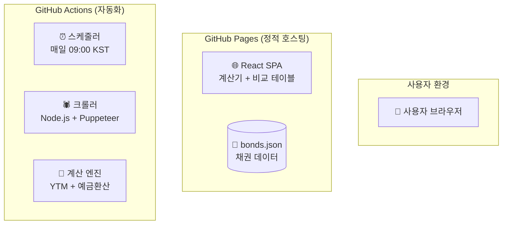
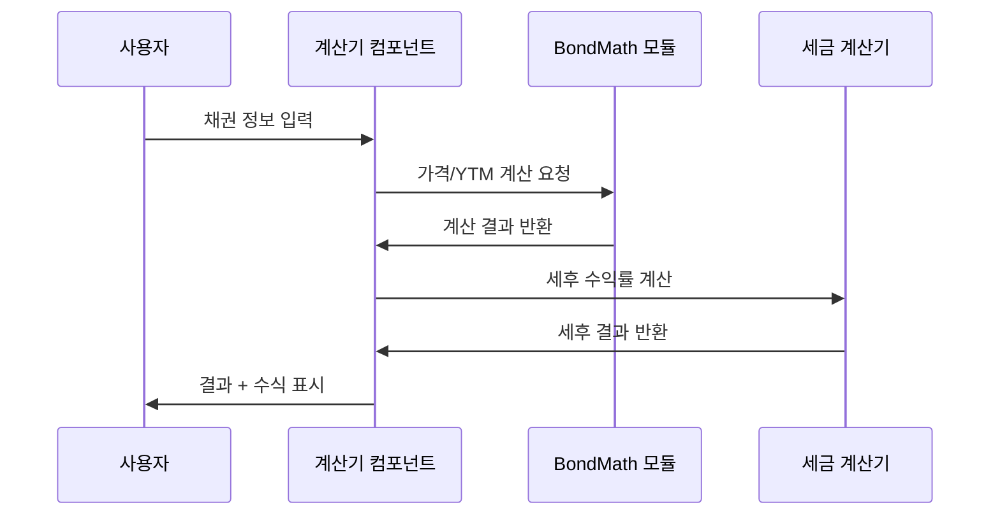
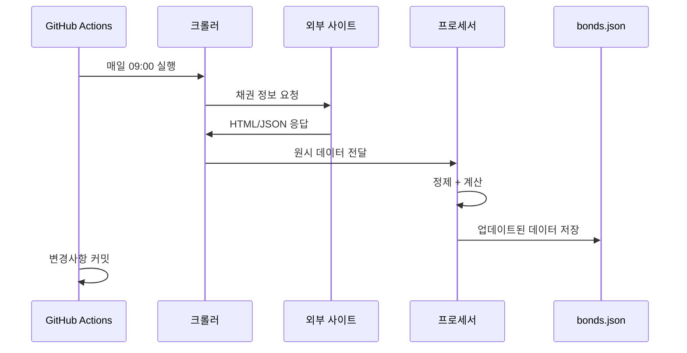

# 🏗️ 아키텍처 설계

## 시스템 개요

All On Bond는 GitHub Pages 기반의 정적 웹 애플리케이션으로, 채권 수익률 계산 및 비교 서비스를 제공합니다.

## 전체 아키텍처



## 컴포넌트 구조

### 1. 프론트엔드 (React SPA)

```
src/
├── components/
│   ├── Calculator/
│   │   ├── BondInputForm.tsx      # 채권 정보 입력
│   │   ├── ResultDisplay.tsx      # 계산 결과 표시
│   │   ├── CashFlowTable.tsx      # 현금흐름 테이블
│   │   └── FormulaTooltip.tsx     # 수식 설명 툴팁
│   ├── Comparison/
│   │   ├── BondTable.tsx          # 채권 비교 테이블
│   │   ├── FilterPanel.tsx        # 필터링 패널
│   │   └── SortControls.tsx       # 정렬 컨트롤
│   ├── Layout/
│   │   ├── Header.tsx             # 상단 네비게이션
│   │   ├── TabNavigation.tsx      # 계산기/비교 탭
│   │   └── Footer.tsx             # 법적 고지사항
│   └── UI/
│       ├── CurrencyToggle.tsx     # 원화/달러 토글
│       ├── TaxToggle.tsx          # 세전/세후 토글
│       └── LastUpdated.tsx        # 마지막 업데이트 표시
├── lib/
│   ├── bondMath.ts               # 채권 수학 계산
│   ├── dayCount.ts               # ACT/365 일수 계산
│   ├── taxCalculation.ts         # 세금 계산
│   └── currencyUtils.ts          # 환율 처리
├── types/
│   ├── bond.ts                   # 채권 타입 정의
│   └── calculation.ts            # 계산 결과 타입
└── data/
    └── bonds.json                # 크롤링된 채권 데이터
```

### 2. 백엔드 (GitHub Actions)

```
.github/workflows/
├── crawl-bonds.yml               # 매일 채권 데이터 수집
└── deploy.yml                    # 프론트엔드 배포

scripts/
├── crawlers/
│   ├── goinsider.ts              # 고인사이더 크롤러
│   ├── samsung.ts                # 삼성증권 크롤러
│   └── base.ts                   # 공통 크롤링 로직
├── processors/
│   ├── bondProcessor.ts          # 채권 데이터 정제
│   ├── yieldCalculator.ts        # 수익률 계산
│   └── taxProcessor.ts           # 세금 계산
└── utils/
    ├── dataValidator.ts          # 데이터 검증
    └── fileManager.ts            # 파일 관리
```

## 기술 스택

### 프론트엔드
- **Framework**: React 18 + TypeScript
- **Build Tool**: Vite
- **Styling**: Tailwind CSS + shadcn/ui
- **State Management**: Zustand (경량)
- **Table**: TanStack Table (정렬/필터)
- **Charts**: Recharts (현금흐름 시각화)
- **Date**: date-fns (날짜 계산)
- **Validation**: Zod (입력 검증)

### 백엔드/자동화
- **Runtime**: Node.js 18+
- **Crawling**: Puppeteer (동적 콘텐츠)
- **HTTP**: Axios (정적 API)
- **Parsing**: Cheerio (HTML 파싱)
- **Scheduling**: GitHub Actions Cron

### 배포/호스팅
- **Hosting**: GitHub Pages
- **Domain**: `username.github.io/AllOnBond`
- **CDN**: GitHub Pages 내장 CDN
- **SSL**: 자동 제공

## 데이터 플로우

### 1. 계산기 플로우


### 2. 데이터 수집 플로우


## 성능 최적화

### 1. 프론트엔드
- **Code Splitting**: 계산기/비교 탭별 lazy loading
- **Memoization**: 복잡한 계산 결과 캐싱
- **Virtual Scrolling**: 대량 채권 데이터 테이블
- **Service Worker**: 오프라인 계산기 지원

### 2. 데이터 처리
- **Pre-computation**: 수익률 사전 계산 후 저장
- **Compression**: gzip 압축된 JSON 제공
- **Incremental Update**: 변경된 채권만 업데이트

## 보안 고려사항

### 1. 크롤링 윤리
- **Rate Limiting**: 요청 간격 제한 (1초 이상)
- **User-Agent**: 명시적 봇 식별
- **robots.txt**: 준수 확인
- **Terms of Service**: 이용약관 검토

### 2. 데이터 보호
- **Input Validation**: 모든 사용자 입력 검증
- **XSS Prevention**: 출력 데이터 이스케이핑
- **HTTPS Only**: 강제 SSL 연결

## 확장성 고려사항

### 1. 다국가 지원
- **Currency**: 추가 통화 지원 (JPY, EUR 등)
- **Market**: 해외 채권 시장 확장
- **Regulation**: 국가별 세법 적용

### 2. 기능 확장
- **Bond Types**: 변동금리채, 전환사채 지원
- **Analytics**: 포트폴리오 분석 기능
- **Alerts**: 수익률 알림 서비스

## 모니터링 및 로깅

### 1. 프론트엔드
- **Error Tracking**: Sentry (무료 티어)
- **Analytics**: Google Analytics 4
- **Performance**: Web Vitals 측정

### 2. 크롤링
- **Success Rate**: 수집 성공률 추적
- **Data Quality**: 이상 데이터 감지
- **Notification**: 실패 시 이슈 생성

---

*이 아키텍처는 무료 호스팅 환경에서 최대한의 기능을 제공하도록 설계되었습니다.*
