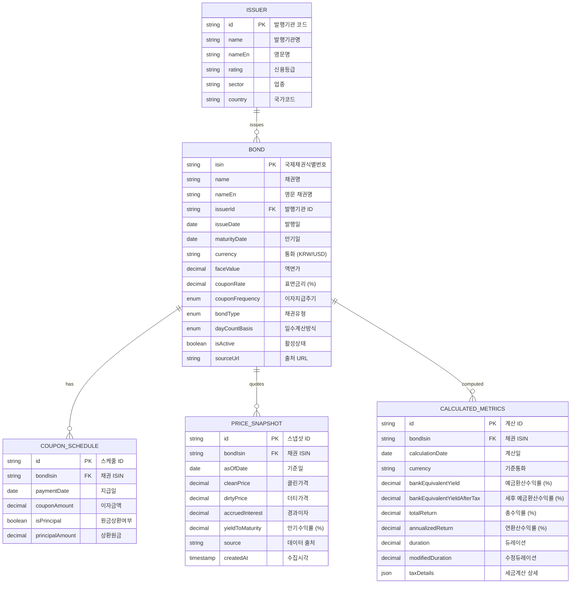

# 📊 데이터 모델

## ERD (Entity Relationship Diagram)



## 데이터 타입 정의

### 1. 열거형 (Enums)

```typescript
// 이자지급주기
enum CouponFrequency {
  ANNUAL = 1,      // 연 1회
  SEMI_ANNUAL = 2, // 연 2회 (반기)
  QUARTERLY = 4,   // 연 4회 (분기)
  MONTHLY = 12,    // 연 12회 (월)
  ZERO = 0         // 무이표채
}

// 채권유형
enum BondType {
  FIXED_RATE = 'fixed',    // 고정금리채
  ZERO_COUPON = 'zero',    // 무이표채 (할인채)
  GOVERNMENT = 'govt',     // 국채
  CORPORATE = 'corp',      // 회사채
  MUNICIPAL = 'muni'       // 지방채
}

// 일수계산방식
enum DayCountBasis {
  ACT_365 = 'ACT/365',     // 실제일수/365일
  ACT_360 = 'ACT/360',     // 실제일수/360일
  THIRTY_360 = '30/360',   // 30일/360일
  ACT_ACT = 'ACT/ACT'      // 실제일수/실제일수
}

// 통화
enum Currency {
  KRW = 'KRW',  // 한국 원
  USD = 'USD'   // 미국 달러
}

// 신용등급
enum CreditRating {
  AAA = 'AAA', AA_PLUS = 'AA+', AA = 'AA', AA_MINUS = 'AA-',
  A_PLUS = 'A+', A = 'A', A_MINUS = 'A-',
  BBB_PLUS = 'BBB+', BBB = 'BBB', BBB_MINUS = 'BBB-',
  BB_PLUS = 'BB+', BB = 'BB', BB_MINUS = 'BB-',
  B_PLUS = 'B+', B = 'B', B_MINUS = 'B-',
  CCC = 'CCC', CC = 'CC', C = 'C', D = 'D',
  NR = 'NR'  // Not Rated
}
```

### 2. 인터페이스 정의

```typescript
// 채권 기본 정보
interface Bond {
  isin: string;
  name: string;
  nameEn?: string;
  issuer: Issuer;
  issueDate: Date;
  maturityDate: Date;
  currency: Currency;
  faceValue: number;
  couponRate: number;
  couponFrequency: CouponFrequency;
  bondType: BondType;
  dayCountBasis: DayCountBasis;
  isActive: boolean;
  sourceUrl?: string;
}

// 발행기관 정보
interface Issuer {
  id: string;
  name: string;
  nameEn?: string;
  rating?: CreditRating;
  sector?: string;
  country: string;
}

// 가격 정보
interface PriceSnapshot {
  bondIsin: string;
  asOfDate: Date;
  cleanPrice: number;
  dirtyPrice?: number;
  accruedInterest?: number;
  yieldToMaturity?: number;
  source: string;
  createdAt: Date;
}

// 쿠폰 스케줄
interface CouponSchedule {
  bondIsin: string;
  paymentDate: Date;
  couponAmount: number;
  isPrincipal: boolean;
  principalAmount?: number;
}

// 계산된 지표
interface CalculatedMetrics {
  bondIsin: string;
  calculationDate: Date;
  currency: Currency;
  bankEquivalentYield: number;
  bankEquivalentYieldAfterTax: number;
  totalReturn: number;
  annualizedReturn: number;
  duration?: number;
  modifiedDuration?: number;
  taxDetails: TaxCalculation;
}

// 세금 계산 상세
interface TaxCalculation {
  interestIncome: number;        // 이자소득
  capitalGain: number;           // 매매차익
  interestTax: number;           // 이자소득세 (15.4%)
  capitalGainTax: number;        // 매매차익세 (0% 개인, 22% 법인)
  totalTaxAmount: number;        // 총 세금
  netReturn: number;             // 세후 수익
  effectiveTaxRate: number;      // 실효세율
}
```

## JSON 스키마 (bonds.json)

GitHub Pages에서 사용할 정적 데이터 파일의 구조입니다.

```json
{
  "metadata": {
    "lastUpdated": "2024-10-07T09:00:00+09:00",
    "dataSource": ["goinsider.kr", "samsungpop.com"],
    "totalBonds": 1250,
    "currencies": ["KRW", "USD"],
    "version": "1.0.0"
  },
  "exchangeRates": {
    "USD_KRW": 1340.50,
    "lastUpdated": "2024-10-07T09:00:00+09:00"
  },
  "issuers": [
    {
      "id": "KDB",
      "name": "한국산업은행",
      "nameEn": "Korea Development Bank",
      "rating": "AA",
      "sector": "정부기관",
      "country": "KR"
    }
  ],
  "bonds": [
    {
      "isin": "KR3831037W13",
      "name": "한국산업은행 2024-37차",
      "nameEn": "KDB 2024-37",
      "issuerId": "KDB",
      "issueDate": "2024-03-15",
      "maturityDate": "2027-03-15",
      "currency": "KRW",
      "faceValue": 10000,
      "couponRate": 3.45,
      "couponFrequency": 2,
      "bondType": "fixed",
      "dayCountBasis": "ACT/365",
      "isActive": true,
      "sourceUrl": "https://goinsider.kr/bond/KR3831037W13"
    }
  ],
  "prices": [
    {
      "bondIsin": "KR3831037W13",
      "asOfDate": "2024-10-07",
      "cleanPrice": 99.85,
      "dirtyPrice": 100.12,
      "accruedInterest": 0.27,
      "yieldToMaturity": 3.52,
      "source": "goinsider.kr",
      "createdAt": "2024-10-07T09:00:00+09:00"
    }
  ],
  "calculations": [
    {
      "bondIsin": "KR3831037W13",
      "calculationDate": "2024-10-07",
      "currency": "KRW",
      "bankEquivalentYield": 3.52,
      "bankEquivalentYieldAfterTax": 2.98,
      "totalReturn": 8.95,
      "annualizedReturn": 3.52,
      "duration": 2.73,
      "modifiedDuration": 2.64,
      "taxDetails": {
        "interestIncome": 1035,
        "capitalGain": -150,
        "interestTax": 159.39,
        "capitalGainTax": 0,
        "totalTaxAmount": 159.39,
        "netReturn": 725.61,
        "effectiveTaxRate": 18.0
      }
    }
  ]
}
```

## 데이터 검증 규칙

### 1. 필수 검증
```typescript
const bondValidationSchema = z.object({
  isin: z.string().regex(/^[A-Z]{2}[A-Z0-9]{10}$/), // ISIN 형식
  name: z.string().min(1).max(100),
  issueDate: z.date(),
  maturityDate: z.date().refine(date => date > new Date()), // 미래 날짜
  currency: z.enum(['KRW', 'USD']),
  faceValue: z.number().positive(),
  couponRate: z.number().min(0).max(50), // 0~50%
  couponFrequency: z.enum([0, 1, 2, 4, 12])
});
```

### 2. 비즈니스 규칙
- **만기일**: 발행일보다 미래여야 함
- **쿠폰율**: 0% 이상 (무이표채 포함)
- **가격**: 액면가의 50%~200% 범위
- **수익률**: -10%~50% 범위 (극단값 제외)

### 3. 데이터 품질 체크
- **중복 제거**: ISIN 기준 중복 채권 제거
- **만료 채권**: 만기일 경과 채권 비활성화
- **이상값 감지**: 통계적 이상값 플래그 처리
- **출처 검증**: 크롤링 소스 URL 유효성 확인

## 인덱싱 전략

### 1. 검색 최적화
```typescript
// 채권 검색용 인덱스
interface BondSearchIndex {
  isin: string;
  name: string;
  issuerName: string;
  keywords: string[]; // 검색 키워드 배열
  maturityYear: number;
  currency: Currency;
  yieldRange: string; // "3.0-4.0" 형태
}
```

### 2. 정렬 최적화
- **만기일순**: `maturityDate` ASC/DESC
- **수익률순**: `yieldToMaturity` DESC/ASC
- **발행기관순**: `issuer.name` ASC
- **통화별**: `currency` + `yieldToMaturity` DESC

## 데이터 마이그레이션

### 1. 버전 관리
```json
{
  "schemaVersion": "1.0.0",
  "migrationHistory": [
    {
      "version": "1.0.0",
      "date": "2024-10-07",
      "changes": ["Initial schema"]
    }
  ]
}
```

### 2. 하위 호환성
- 새 필드 추가 시 기본값 제공
- 필드 제거 시 deprecated 마킹 후 점진적 제거
- 타입 변경 시 변환 함수 제공

---

*이 데이터 모델은 채권 계산의 정확성과 확장성을 고려하여 설계되었습니다.*
